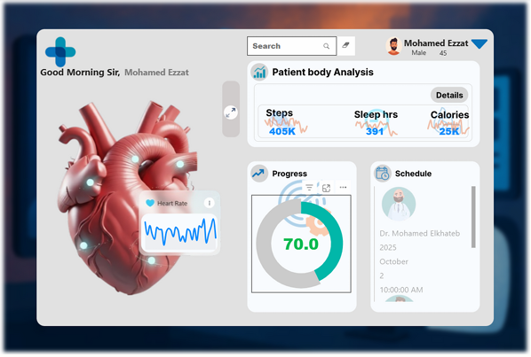

# 🩺 Healthcare Monitoring Dashboard

## Overview  
The **Healthcare Monitoring Dashboard** is an interactive and insightful analytics solution built to visualize patient health metrics and support better wellness tracking. It combines **real-time data monitoring**, smart scheduling, and personalized filtering to provide a unified view of patient health and performance trends.

---

## 🎯 Objectives
- Provide a **comprehensive view** of patient health indicators.  
- Enable **real-time tracking** of key metrics such as heart rate, steps, and sleep hours.  
- Support **personalized analysis** through filtering by patient or health condition.  
- Facilitate **smart scheduling** for upcoming medical appointments.

---

## 💡 Key Features
### 🔹 Health Metrics Visualization  
- Track daily and weekly performance across heart rate, steps, sleep, and calories burned.  
- Visualize wellness trends through interactive charts and KPIs.

### 🔹 Smart Scheduling  
- Integrated calendar panel for doctor appointments and health check reminders.  
- Automatic highlighting of upcoming or overdue sessions.

### 🔹 Dynamic Search & Filtering  
- Search and filter patient data by name, condition, or time period.  
- Personalized insights for both patients and healthcare providers.

---

## Tools & Technologies
- **Power BI** – Dashboard design & data visualization  
- **Excel / CSV Data Sources** – Data preparation and cleaning  

---

## 📈 Value Proposition  
This project demonstrates strong analytical and visualization skills in **healthcare data analytics**, focusing on turning complex medical data into **actionable insights** for better patient care and operational efficiency.

---

## 🚀 How to Use
1. Download or clone this repository.  
2. Open the Power BI file (`.pbix`).  
3. Refresh the data sources to load updated metrics.  
4. Explore the dashboard using interactive charts and filters.

---

## Author  
**Mahmoud Hamdi**  
Data Analyst | Power BI & Python Enthusiast  
[LinkedIn](www.linkedin.com/in/mahmoudelqalini) • [GitHub](https://github.com/Mahmoud-Elqalini) • [Email](mahmoudeq02@gmail.com)
